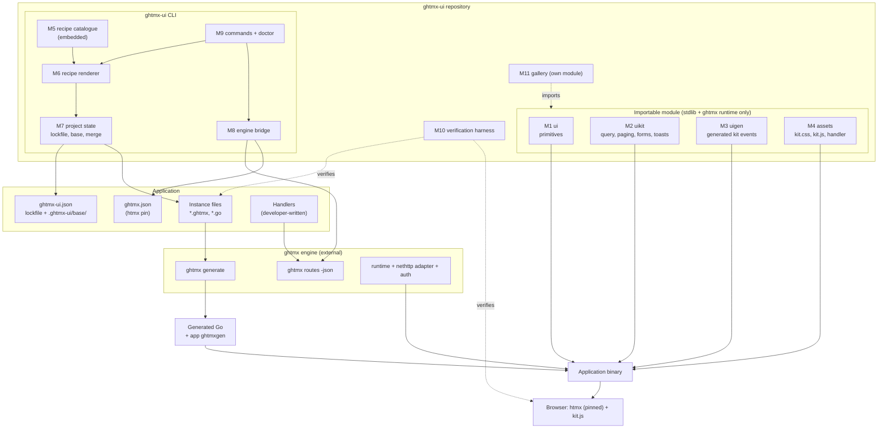
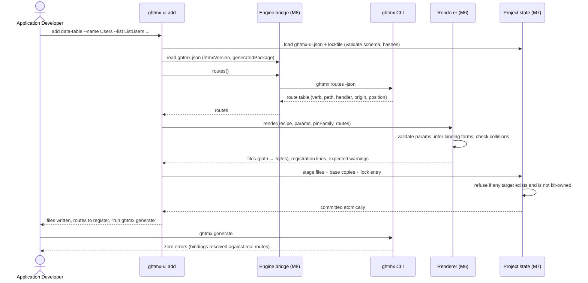
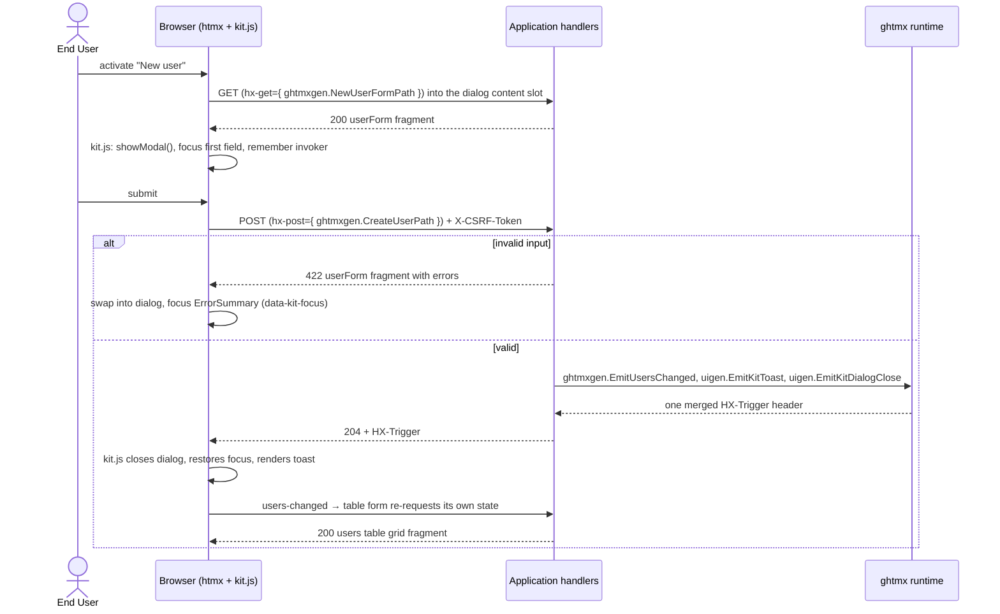
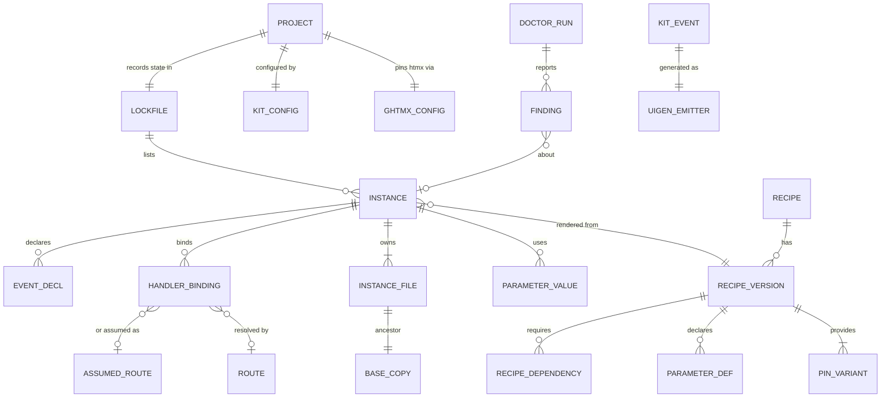

# Solution Design — ghtmx UI (`ghtmx-ui`)

## Overview

### Description

`ghtmx-ui` is a component kit for applications built with the ghtmx engine. It ships accessible, strict-CSP-safe UI patterns without asking the application to write JavaScript or hand-write htmx wiring, and without asking the engine to check less.

The design is driven by a single engine rule. ghtmx's first carve-out turns the five verb attributes into typed bindings: `hx-post={ handlers.CreateUser }` or `hx-put={ ghtmxgen.RenameUser(id) }`, never a string or an arbitrary expression. A template compiled inside a third-party module can neither name the consuming application's handlers nor import its generated package, so an importable component cannot carry a binding the engine would check. The kit therefore splits in two:

1. **Primitives** (`ui`) — importable, htmx-free components: buttons, alerts, form fields with error association, the error summary, live regions, asset tags. Free of `hx-*` attributes, they are valid under every htmx pin.
2. **Recipes** — parameterised `.ghtmx` sources embedded in the `ghtmx-ui` CLI. `ghtmx-ui add` renders one into the application's own package, bound to the application's own handlers (looked up in `ghtmx routes -json`) and written in the dialect of its pinned htmx version. From then on the files belong to the application, and the application's `ghtmx generate` checks them like any other template.

Around these sit three supporting pieces: a typed Go helper package (`uikit`) for table query state, pagination, form errors, and toasts; the kit's own event contract (`uigen`, generated by the engine from two `event` declarations); and one stylesheet plus one ES module, served by an embedded asset handler with Subresource Integrity.

### Technology Stack

| Layer | Choice | Rationale |
| --- | --- | --- |
| Language | Go, two most recent releases | Matches the engine's CI matrix |
| Engine | Upstream `github.com/go-monolith/ghtmx` ≥ v0.1.23 (verified against v0.2.1) | First release with both `auth` and htmx 4; names follow upstream, mapped to the `go-htmx-template-engine` sample in the constitution |
| Templates | `.ghtmx`, compiled by `ghtmx generate`; generated files committed | Engine convention; consumers need no generation step for the module |
| Recipe rendering | `text/template` with `[[ ]]` delimiters | Stdlib, deterministic, and cannot collide with `.ghtmx`'s `{ }` (D2) |
| Route information | `ghtmx routes -json` via subprocess | The engine's internals are unimportable by design (D7) |
| Merge | In-process diff3 over committed base copies | No git dependency; deterministic on every OS (D4) |
| Behaviour | One hand-written ES2020 module, `type="module"` | No build step; strict-CSP friendly |
| Styling | One stylesheet in `@layer kit`, `--kit-*` custom properties, logical properties | Overridable without specificity fights; RTL for free |
| Assets | `embed.FS`, content-hashed names, SHA-384 SRI | Immutable caching; integrity under CSP |
| Browser tests | `chromedp` + pinned `axe-core` script | Go-only toolchain, no Node (D11) |
| Gallery | Separate Go module, chi + engine chi adapter; native and `js/wasm` on Cloudflare Workers | Mirrors the engine's documentation site |
| Distribution | `go install` and checksummed release archives | Matches the engine |

### Design Decisions Summary

| # | Decision | Driver |
| --- | --- | --- |
| D1 | Two-tier delivery: importable htmx-free primitives, vendored recipes | Engine carve-out 1 makes importable htmx components uncheckable |
| D2 | Recipes rendered with `text/template` using `[[ ]]` delimiters | Determinism, stdlib only, no delimiter collision |
| D3 | One source tree per pin family, not conditional markup | P6: each variant is simple and engine-checked against its own surface |
| D4 | Committed base copies plus in-process diff3 | P3: updates that never lose local edits, on any clone, without git |
| D5 | Kit events live in the kit's own generated package (`uigen`) | Kit contract is versioned with the kit; the runtime merges headers across packages |
| D6 | Dialog host markup lives in the shell instance, not a primitive | `#kit-dialog-content` must be a static id in the app's compiled set (`GHTMX-W0201`) |
| D7 | Route information only via `ghtmx routes -json` | A3: consume the engine, never re-implement it |
| D8 | A GET form is the single state carrier for navigation-shaped recipes | P4: no-JS parity and one URL truth |
| D9 | `422` for validation failures under both pin families | Truthful status codes; each family gets its own mechanism |
| D10 | Busy state expressed as `aria-busy`, set by `kit.js` | Pin-agnostic, and announces busyness to assistive technology |
| D11 | Go-only browser verification with `chromedp` and `axe-core` | Constitution bans Node from every path |
| D12 | Recipes bind only through the central generated package, never by bare handler symbol | No import edge from instance to handlers, so no import cycle and free package layout |

## High-Level Architecture Design

The kit has a **build-time side** (the CLI rendering recipes into the application) and a **run-time side** (primitives, helpers, events, and assets imported by the application). The engine stands between them: everything the CLI writes is compiled and checked by the engine before it can run.



### `add` sequence



### Modal-form round trip



## System Modules

### M1 — Primitives (`ui`)

**Responsibilities**

- Provide the FR-001 primitive catalogue as `.ghtmx` templates with committed generated code.
- Uphold each primitive's accessibility contract (labels, `aria-describedby` ordering, `aria-invalid`, live-region roles).
- Guard pass-through attributes (FR-004) and render asset tags with SRI and nonce (FR-008).

**Key Components**

- Props structs with typed option constants (`ButtonVariant`, `Tone`, `InputType`). Option types have a non-string underlying type (`type ButtonVariant uint8`) and a `String()` method, so an untyped string constant such as `"danger"` cannot convert silently (FR-002).
- `ids.go` — deterministic id derivation (`FieldID(name)`, `HintID(name)`, `ErrorID(name)`).
- `passthrough.go` — validation of `ui.Attrs` (rejects `hx-*` and contract-owned keys).

**Key Interfaces**

```go
type Attrs map[string]string // validated pass-through; never hx-*

type ButtonProps struct {
    Label   string
    Variant ButtonVariant // ButtonPrimary (zero value), ButtonSecondary, ButtonDanger, ButtonGhost
    Size    Size
    Type    ButtonType    // ButtonTypeButton (zero value), ButtonTypeSubmit
    Attrs   Attrs
}

type FieldProps struct {
    Name     string   // also the source of every derived id
    Label    string   // required: empty label is a render error
    Hint     string
    Errors   []string // from uikit.FormErrors.For(Name)
    Required bool
    Value    string
    Attrs    Attrs
}
```

Each exported primitive is a Go function that validates its props and then returns the unexported template, so a contract violation is reported before a byte is written:

```go
func TextField(p FieldProps, kind InputType) ghtmx.Component {
    if err := p.validate(); err != nil { // missing label, hx-* or contract-owned pass-through key
        return failed(err)                // Render returns a ghtmx.Error naming the violation
    }
    return textField(p, kind)
}
```

```templ
templ textField(p FieldProps, kind InputType) {
	<div class="kit-field">
		<label for={ FieldID(p.Name) }>{ p.Label }</label>
		if p.Hint != "" {
			<p class="kit-hint" id={ HintID(p.Name) }>{ p.Hint }</p>
		}
		<input
			id={ FieldID(p.Name) }
			name={ p.Name }
			type={ kind.String() }
			value={ p.Value }
			required?={ p.Required }
			if len(p.Errors) > 0 {
				aria-invalid="true"
			}
			if describedBy(p) != "" {
				aria-describedby={ describedBy(p) }
			}
			{ p.Attrs.attributes()... }
		/>
		if len(p.Errors) > 0 {
			<div class="kit-error" id={ ErrorID(p.Name) }>
				for _, msg := range p.Errors {
					<p>{ msg }</p>
				}
			</div>
		}
	</div>
}
```

`aria-invalid` is written as a conditional constant attribute rather than a boolean attribute, because a bare `aria-invalid` evaluates to an empty value, which assistive technology treats as false.

**Dependencies** — Go standard library, ghtmx runtime, M2 (form error lookup), M4 (asset digests).

**Error Handling** — contract violations (missing label, `hx-*` pass-through) return a `ghtmx.Error` from `Render`, so the adapter answers with its error handler instead of streaming half a page.

### M2 — Go Helpers (`uikit`)

**Responsibilities**

- Parse and canonicalise table state (FR-040, FR-041).
- Compute pagination windows and announcement text (FR-043).
- Provide the shared form error model (FR-042) and typed toast wrappers (FR-035).

**Key Interfaces**

```go
type TableSpec struct {
    Sortable    []string // allow-list, in column order
    DefaultSort string   // "name" or "-name"
    PageSizes   []int    // first entry is the default
}

type TableQuery struct {
    Sort  string // key from Sortable, "-" prefix for descending
    Page  int
    Size  int
    Q     string
}

// ParseTableQuery never fails: invalid input falls back to defaults.
// An optional "set" value ("sort:-name", "page:3", "size:50") from the
// submitting button overrides one field; sort, size and filter changes reset Page to 1.
func ParseTableQuery(v url.Values, spec TableSpec) TableQuery
func (q TableQuery) Encode(spec TableSpec) string // canonical: defaults omitted, fixed key order
func (q TableQuery) URL(path string, spec TableSpec) string
func (q TableQuery) NextSort(key string) string // value for the header's "set" button
func (q TableQuery) AriaSort(key string) string // "ascending", "descending" or "none"
func (q TableQuery) Desc() bool
func CanonicalRedirect(w http.ResponseWriter, r *http.Request, q TableQuery, spec TableSpec) bool

type PageInfo struct {
    First, Last, Total, Page, Pages int
    Window []int // 0 marks a gap
}
func NewPageInfo(q TableQuery, total int) PageInfo
func (p PageInfo) Summary(sortLabel string, desc bool) string // "Showing 21–40 of 312, sorted by Name ascending"

type FormErrors struct{ /* ordered field → messages */ }
func (e *FormErrors) Add(field, msg string)
func (e FormErrors) For(field string) []string
func (e FormErrors) Empty() bool

func ToastSuccess(w http.ResponseWriter, msg string) error // wraps uigen.EmitKitToast
func ToastInfo(w http.ResponseWriter, msg string) error
func ToastError(w http.ResponseWriter, msg string) error
```

**Dependencies** — standard library, M3.

**Error Handling** — `ParseTableQuery` is total over its input (no error return); `CanonicalRedirect` only acts on non-htmx GET requests, detected with `ghtmx.IsHTMXRequest`.

### M3 — Kit Event Contract (`uigen`)

**Responsibilities**

- Declare the kit's events once and expose only engine-generated emitters (FR-035).

**Key Components**

```templ
package uievents

event KitToast(level string, message string)

event KitDialogClose(id string)
```

The kit maintainers run `ghtmx generate` over the kit module and commit the output. The module's `ghtmx.json` names the central generated package `uigen`, disables the htmx script helper (`htmxScript: false` — the module loads no htmx), and sets `GHTMX-W0102` to `off`, because these events are consumed by `kit.js` rather than by a template listener. The setting is scoped to the kit module's own build and never reaches applications, which consume committed generated code. Primitives carry no `hx-*` attribute, so the module's own pin never changes their output; the base `Emit*` emitters write the `HX-Trigger` header that both pin families read, and FR-038's test runs under both.

**Dependencies** — ghtmx runtime.

**Error Handling** — emitters return the runtime's serialisation error; `uikit` wrappers propagate it.

### M4 — Assets (`assets`, `assets/src/kit.css`, `assets/src/kit.js`)

**Responsibilities**

- Ship the stylesheet (FR-060–FR-063) and behaviour module (FR-050–FR-054, FR-036, FR-037, FR-039).
- Serve both with hashed names, immutable caching, and SRI digests (FR-044).

**Key Components**

- `kit.css` — `@layer kit { … }` with token layer (`--kit-color-*`, `--kit-space-*`, `--kit-radius-*`, `--kit-focus-ring`), component rules, `[aria-busy="true"] .kit-indicator` visibility (D10), `prefers-reduced-motion` and `forced-colors` blocks.
- `kit.js` — delegated listeners on `document`; per-feature modules inside one file: `dialog`, `toasts`, `focus`, `announce`, `combobox`, `tabs`, `inlineEdit`, `busy`, `failures`.
- `handler.go` — `assets.Handler()`, `assets.Path(name)`, `assets.Integrity(name)`; digests computed once at init from the embedded bytes.

**Key Interfaces (DOM contract)**

| Attribute | Placed on | Behaviour |
| --- | --- | --- |
| `data-kit-dialog` | shell `<dialog>` | Opens modally when `#kit-dialog-content` receives content; closes on `kit-dialog-close` |
| `data-kit-dialog-open` | control that loads dialog content | Recorded as the focus-return target |
| `data-kit-focus` | element in swapped content | Receives focus after the swap |
| `data-kit-announce` | element in swapped content | Text copied into the `Announcer` region |
| `data-kit-toasts` | `ToastRegion` container | Receives rendered `kit-toast` events |
| `data-kit-combobox` | combobox wrapper | APG combobox keyboard and selection |
| `data-kit-tabs` | `role="tablist"` | Roving `tabindex`, manual activation |
| `data-kit-inline-edit` | edit fragment root | Escape activates Cancel; focus/select on entry |
| `data-kit-dirty-guard` | form | Confirm before discarding modified input |

**Lifecycle adaptation (FR-051).** At load, `kit.js` reads `htmx.version`; a `2.` prefix selects the htmx 2 event names (`htmx:afterSwap`, `htmx:beforeRequest`, `htmx:afterRequest`, `htmx:responseError`, `htmx:sendError`), and a `4.` prefix selects the htmx 4 colon-form equivalents (`htmx:after:request` and peers) from a second table. Both tables are covered by the dual-pin browser suites, so a renamed event fails CI rather than a user's session.

**Dependencies** — none at run time beyond the browser and, optionally, htmx.

**Error Handling** — every listener is wrapped so that an exception in one feature logs once to `console.error` and never blocks htmx processing.

### M5 — Recipe Catalogue (`recipes/`)

**Responsibilities**

- Hold the ten recipes, each as `recipe.json` plus `htmx2/` and `htmx4/` source trees (D3).

**Key Components**

`recipe.json` declares the recipe id, version, description, dependencies, parameter schema, expected engine warnings, and the files each variant emits:

```json
{
  "id": "data-table",
  "version": "0.3.0",
  "requires": ["shell"],
  "params": [
    {"name": "name", "kind": "identifier", "required": true},
    {"name": "rowType", "kind": "goType", "required": true},
    {"name": "idField", "kind": "identifier", "default": "ID"},
    {"name": "list", "kind": "handler", "verb": "GET", "pathParams": 0, "required": true},
    {"name": "delete", "kind": "handler", "verb": "DELETE", "pathParams": 1},
    {"name": "confirmDelete", "kind": "handler", "verb": "GET", "pathParams": 1},
    {"name": "editWith", "kind": "instance", "recipe": "modal-form"},
    {"name": "column", "kind": "fieldList", "repeatable": true, "required": true},
    {"name": "sortable", "kind": "keyList"},
    {"name": "pageSizes", "kind": "intList", "default": [25, 50, 100]},
    {"name": "filter", "kind": "bool", "default": true}
  ],
  "expectedWarnings": [],
  "emits": ["[[.snake]]_table.ghtmx", "[[.snake]]_table_cells.go", "[[.snake]]_table_spec.go"],
  "stubs": ["[[.snake]]_table_handlers.go"]
}
```

| Recipe | Emits (instance `Users`) | Handler slots |
| --- | --- | --- |
| `shell` | `shell.ghtmx`, `shell.go` | — |
| `data-table` | `users_table.ghtmx`, `users_table_cells.go`, `users_table_spec.go` | `list` (GET), `confirmDelete` (GET, 1 param), `delete` (DELETE, 1 param) |
| `active-search` | `users_search.ghtmx` | `search` (GET) |
| `combobox` | `users_picker.ghtmx` | `options` (GET) |
| `modal-form` | `user_form.ghtmx`, `user_form_values.go` | `open` (GET), `edit` (GET, 1 param), `create` (POST), `update` (PUT, 1 param) |
| `validated-form` | `profile_form.ghtmx`, `profile_form_values.go` | `submit` (POST or PUT) |
| `inline-edit` | `user_name_edit.ghtmx` | `view`, `edit` (GET, 1 param), `save` (PUT/PATCH, 1 param) |
| `tabs` | `account_tabs.ghtmx` | one GET handler per tab |
| `load-more` | `activity_feed.ghtmx` | `page` (GET) |
| `login-form` | `sign_in.ghtmx`, `sign_in_values.go` | `form` (GET), `submit` (POST) |

**Dependencies** — none; data only, embedded into the CLI with `embed.FS`.

### M6 — Recipe Renderer (`internal/recipe`)

**Responsibilities**

- Load and hash-verify manifests and sources; validate parameters (FR-011).
- Infer binding forms from the route table (FR-012) and choose the pin-family variant (FR-013).
- Derive instance names, ids, and events (FR-014, FR-015); render stubs (FR-016); resolve dependencies (FR-017).

**Key Interfaces**

```go
type Request struct {
    Recipe     string
    Instance   string
    Params     map[string]any
    Pin        PinFamily        // htmx2 | htmx4
    GenPkg     GenPackage       // import path + name of the app's central generated package
    Routes     []enginebridge.Route
    Assumed    []AssumedRoute   // from --assume
    StubRouter string           // "", "nethttp", "chi"
    Existing   []project.Instance
}

type Result struct {
    Files        []File   // path → bytes, all new
    Registration []string // router lines to print, never written
    Expected     []string // engine warning IDs this instance may raise
    LockEntry    project.Instance
}

func Render(req Request) (Result, []Problem)
```

**Binding inference.** For each `handler` parameter the renderer finds the route whose handler symbol matches. Zero path parameters produce a `<Route>Path` binding (`hx-get={ ghtmxgen.ListUsersPath }`), reused as `ghtmx.URL(ghtmxgen.ListUsersPath)` where the recipe needs an `href` or `action`. One or more produce a constructor binding (`ghtmxgen.EditUser(row.ID)`). Bare symbol bindings are never emitted (D12). The route's verb must match the slot's declared verb. A handler absent from the table needs `--stub` or `--assume`; an assumption is checked for verb and parameter count and recorded in the lock entry.

**Template functions.** The renderer exposes only pure functions — `lower`, `snake`, `kebab`, `goString`, `join` — and a sorted view of every map, so output never depends on iteration order (NFR-007).

**Dependencies** — M5, M7 (types only), M8 (route types).

**Error Handling** — every problem is collected (not first-fail) and reported with the parameter name and expected form; any problem means no files.

### M7 — Project State (`internal/project`, `internal/merge`)

**Responsibilities**

- Read and write `ghtmx-ui.json`, the lockfile, and base copies (DATA-002–DATA-004).
- Stage and commit multi-file writes atomically; refuse to touch non-kit files (FR-080).
- Three-way merge for `update` (FR-074) and modification detection for `diff` and `remove`.

**Key Components**

- `Lock` — schema-versioned, sorted-key JSON; per-file SHA-256 of the base copy.
- `Stage` — writes every file to a temp sibling, fsyncs, then renames in path order; on failure, removes the temps. A `.ghtmx-ui/txn` marker left by an interrupted commit is detected and rolled back on the next command.
- `merge.Diff3(base, local, remote []byte) (merged []byte, conflicts []Hunk)` — line-based, with a whitespace-insensitive pre-pass so `ghtmx fmt` reflows are not reported as conflicts.

**Error Handling** — schema or hash mismatches are surfaced as doctor findings (`KIT-E040`–`KIT-E042`) and block `update`.

### M8 — Engine Bridge (`internal/enginebridge`)

**Responsibilities**

- Locate the `ghtmx` binary, run `ghtmx version`, and check it against the supported range (v0.1.23 or later).
- Run `ghtmx routes -json` and decode the route table (verb, path, handler, origin, recognizer, position).
- Read `ghtmx.json` for `htmxVersion` and `generatedPackage` (defaults `2.0.10` and `ghtmxgen`).

**Key Interfaces**

```go
type Route struct {
    Verb, Path, Handler, Origin string
    Params                       []string
    Pos                          string
}

type Engine interface {
    Version(ctx context.Context) (semver string, err error)
    Routes(ctx context.Context, dir string) ([]Route, error)
    Config(dir string) (Config, error)
}
```

**Error Handling** — a missing or out-of-range engine is exit code 3 with the install command; a non-zero `routes` exit surfaces the engine's own diagnostics verbatim (for example `GHTMX-E0402` for an unresolvable registration).

### M9 — CLI and Doctor (`cmd/ghtmx-ui`, `internal/doctor`)

**Responsibilities**

- Commands `init`, `add`, `list`, `diff`, `update`, `remove`, `doctor` (FR-070–FR-077).
- Doctor checks and the finding catalogue.

**Key Components** — a flag-based command router (stdlib `flag`), human and `-json` reporters, and the doctor check registry; each check is a function `func(Project) []Finding`.

**Error Handling** — no prompts; missing input is exit code 2 naming the flag.

### M10 — Verification Harness (`internal/gates`, `verify/` module)

**Responsibilities**

- Gates inside the main module: import isolation (NFR-012), "no `hx-*` in primitives" (FR-003), asset size budgets (NFR-004), render allocation baseline (NFR-008), gallery coverage (NFR-014).
- The `verify/` module: generates the fixture matrix (recipe × pin `2.0.0`/`2.0.10`/`4.0.0` × stub router `nethttp`/`chi`), runs the engine and Go toolchain over each fixture (NFR-005, NFR-006), and drives `chromedp` suites — `axe-core` scan, keyboard script, strict-CSP run (repeated with `allowEval` off under `htmx2`), a `403`/`500` injection run against every recipe endpoint, JavaScript-disabled run (NFR-001–NFR-003, NFR-009).
- Cross-platform determinism check: instance hashes from Linux, macOS, and Windows jobs must match (NFR-007).
- WebAssembly gate: a fixture importing the module plus one instance of every recipe builds for `js/wasm` and `wasip1/wasm` (NFR-011).

**Dependencies** — `chromedp`, pinned `axe-core` asset (checksum verified), the engine binary.

### M11 — Gallery Site (`gallery/`)

**Responsibilities**

- A ghtmx application built with the kit itself: one page per primitive and per recipe, each with a live demo, parameter table, keyboard map, and accessibility notes (NFR-014).
- Demos run under both pin families side by side, each in its own document with its own pinned script, the pattern the engine's documentation site uses for its htmx 4 examples.
- Deployed natively and as `js/wasm` to Cloudflare Workers (INT-008).

## Data Model



### Entity descriptions

| Entity | Description |
| --- | --- |
| `GHTMX_CONFIG` | The engine's `ghtmx.json`; the kit reads `htmxVersion` and `generatedPackage` and never writes it. |
| `KIT_CONFIG` | `ghtmx-ui.json`: instance directory, instance package, default stub router, initialising kit version. |
| `LOCKFILE` | `ghtmx-ui.lock.json`, schema-versioned, sorted keys. |
| `INSTANCE` | Name, recipe id and version, pin family, parameters, assumed routes, files. Unique by name. |
| `INSTANCE_FILE` | Relative path and SHA-256 of its base copy; the working file may diverge freely. |
| `BASE_COPY` | Pristine rendering under `.ghtmx-ui/base/<path>`; the merge ancestor. |
| `PIN_VARIANT` | `htmx2` or `htmx4` source tree for a recipe version. |
| `HANDLER_BINDING` | Slot name, handler symbol, binding form (`<Route>Path` constant or typed constructor), verb. |
| `ROUTE` | Entry from `ghtmx routes -json`; never persisted by the kit. |
| `ASSUMED_ROUTE` | `VERB /path` declared with `--assume` for a handler not yet written. |
| `EVENT_DECL` | Per-instance change event (`UsersChanged`), part of the application's event contract. |
| `KIT_EVENT` | `KitToast`, `KitDialogClose`, part of the kit's own contract. |
| `FINDING` | Doctor result: stable ID, severity, message, remedy, optional instance. |

Example lockfile:

```json
{
  "schema": 1,
  "kitVersion": "0.1.0",
  "instances": {
    "Users": {
      "recipe": "data-table",
      "recipeVersion": "0.3.0",
      "pinFamily": "htmx2",
      "params": {
        "column": ["name=Name", "email=Email", "joined=CreatedAt"],
        "confirmDelete": "ConfirmDeleteUser",
        "delete": "DeleteUser",
        "editWith": "UserForm",
        "list": "ListUsers",
        "rowType": "store.User",
        "sortable": ["name", "joined"]
      },
      "assumed": [],
      "files": {
        "internal/web/users_table.ghtmx": "sha256:5f0c…",
        "internal/web/users_table_cells.go": "sha256:a91e…",
        "internal/web/users_table_spec.go": "sha256:07bd…"
      }
    }
  }
}
```

## API / Protocol Design

### Instance contract: `data-table`

The rendered `htmx2` instance for `Users`, abridged. Every route is bound through the application's central generated package (D12), so the instance could live in any package; here it shares `internal/web` with its stubs. Every verb attribute is a binding; the GET form is the only state carrier (D8); ids are instance-derived (FR-014).

```templ
package web

import (
	"strconv"

	"example.com/app/ghtmxgen"
	"example.com/app/store"
	"github.com/go-monolith/ghtmx-ui/uikit"
)

event UsersChanged()

templ usersTable(rows []store.User, q uikit.TableQuery, p uikit.PageInfo) {
	<form
		id="users-table"
		class="kit-table"
		method="get"
		action={ ghtmx.URL(ghtmxgen.ListUsersPath) }
		hx-get={ ghtmxgen.ListUsersPath }
		hx-trigger="submit, users-changed from:body"
		hx-target="#users-table-grid"
		hx-swap="outerHTML"
		hx-sync="this:replace"
	>
		<div class="kit-field">
			<label for="users-filter">Filter users</label>
			<input
				id="users-filter"
				type="search"
				name="q"
				value={ q.Q }
				maxlength="200"
				hx-get={ ghtmxgen.ListUsersPath }
				hx-trigger="input changed delay:300ms, search"
				hx-include="closest form"
				hx-vals='{"set": "page:1"}'
				hx-target="#users-table-grid"
				hx-swap="outerHTML"
				hx-sync="closest form:replace"
			/>
			<button type="submit" name="set" value="page:1">Apply filter</button>
		</div>
		@usersTableGrid(rows, q, p)
	</form>
}

fragment usersTableGrid(rows []store.User, q uikit.TableQuery, p uikit.PageInfo) {
	<div id="users-table-grid">
		<input type="hidden" name="sort" value={ q.Sort }/>
		<input type="hidden" name="page" value={ strconv.Itoa(p.Page) }/>
		<p class="kit-table-summary" data-kit-announce>{ p.Summary(usersSortLabel(q), q.Desc()) }</p>
		<table>
			<caption id="users-table-caption" tabindex="-1">Users</caption>
			<thead>
				<tr>
					<th scope="col" aria-sort={ q.AriaSort("name") }>
						<button type="submit" name="set" value={ q.NextSort("name") }>Name</button>
					</th>
					<th scope="col">Email</th>
					<th scope="col" aria-sort={ q.AriaSort("joined") }>
						<button type="submit" name="set" value={ q.NextSort("joined") }>Joined</button>
					</th>
				</tr>
			</thead>
			<tbody>
				for _, row := range rows {
					<tr id={ "users-row-" + row.ID }>
						<td>{ usersCellName(row) }</td>
						<td>{ usersCellEmail(row) }</td>
						<td>{ usersCellJoined(row) }</td>
					</tr>
				}
			</tbody>
		</table>
		@usersPager(p)
	</div>
}
```

The Apply button is deliberately the first submit button in the form, which makes it the form's default button: pressing Enter in the filter submits through it (keeping the sort, resetting to page 1) rather than through the first sort header. The pager and the row actions are elided. The pager renders `<button type="submit" name="set" value="page:N">` controls, so pagination works through the same form with or without JavaScript. The `usersCell*` accessors live in the developer-owned `users_table_cells.go`, so cell formatting is plain Go and a wrong field name is a Go compile error. Both `hx-target` selectors name a static id in the same file, so `GHTMX-W0201` stays silent. The `htmx4` variant differs only in the attributes listed in the pin-family table below: both requesting elements (the form and the filter input) also carry `hx-status:4xx="swap:none"` and `hx-status:5xx="swap:none"`.

### Handler stub contract (`--stub nethttp`)

Written to a new file, `users_table_handlers.go`, in the instance package.

```go
func ListUsers(w http.ResponseWriter, r *http.Request) {
	q := uikit.ParseTableQuery(r.URL.Query(), usersTableSpec)
	if uikit.CanonicalRedirect(w, r, q, usersTableSpec) {
		return
	}
	rows, total, err := loadUsers(r.Context(), q) // TODO(ghtmx-ui): implement data access
	if err != nil {
		http.Error(w, "internal error", http.StatusInternalServerError)
		return
	}
	p := uikit.NewPageInfo(q, total)
	err = nethttp.Render(w, r,
		nethttp.WithPage(usersPage(rows, q, p), usersTableGridFragment(rows, q, p)),
		nethttp.PushURL(q.URL(ghtmxgen.ListUsersPath, usersTableSpec)))
	if err != nil {
		log.Printf("render users table: %v", err)
	}
}
```

`nethttp.WithPage` renders the whole `usersPage` for a full-page request and only the grid fragment for an htmx request; the pushed URL is the canonical one, so the address bar and a later full-page load agree.

Registration lines printed, never written:

```text
mux.HandleFunc("GET /users", web.ListUsers)
mux.HandleFunc("GET /users/{id}/delete", web.ConfirmDeleteUser)
mux.HandleFunc("DELETE /users/{id}", web.DeleteUser)
```

### Pin-family differences

| Concern | `htmx2` variant | `htmx4` variant |
| --- | --- | --- |
| CSRF header on `<body>` | `hx-headers={ ghtmx.CSRFHeader(token) }` | `hx-headers:inherited={ ghtmx.CSRFHeader(token) }` |
| Swapping `422` | Shell `htmx-config` meta restates the whole `responseHandling` list, because setting it replaces the default: `[{"code":"204","swap":false},{"code":"[23]..","swap":true},{"code":"422","swap":true},{"code":"[45]..","swap":false,"error":true}]` | Exact `hx-status:422` rule on the requesting element (htmx 4 matches the exact code before `42x`/`4xx`) |
| Error responses (`4xx` other than `422`, `5xx`) | Not swapped: the `[45]..` rule marks them as errors; `kit.js` raises the error toast | htmx 4 swaps every status except `204`/`304`, so **every** requesting element (forms, inputs, buttons, links) carries `hx-status:4xx="swap:none"` and `hx-status:5xx="swap:none"`; `kit.js` raises the error toast |
| Disabling controls in flight | `hx-disabled-elt` | `hx-disable` |
| Inline style injection | Shell config turns off htmx's injected indicator styles | Shell applies whatever the pinned build requires; the CSP suite proves zero inline styles |
| Inheritance | Relied upon only for the shell's CSRF header on `<body>`; every other attribute sits on the requesting element | Same, with the CSRF header written `hx-headers:inherited` as htmx 4 requires, so no `GHTMX-W0202` is raised |

### CLI command surface

| Command | Purpose | Key flags |
| --- | --- | --- |
| `ghtmx-ui init` | Config, lockfile, shell instance | `--dir`, `--package`, `--csrf`, `--stub` |
| `ghtmx-ui add <recipe>` | Instantiate a recipe | `--name`, recipe params, `--params`, `--dir`, `--stub`, `--assume`, `--dry-run` |
| `ghtmx-ui list` | Recipes, or instances with `--instances` | `-json` |
| `ghtmx-ui diff [<Instance>]` | Local edits vs. base; `--upstream` vs. newer recipe | `-check`, `-json` |
| `ghtmx-ui update [<Instance>…]` | Three-way update | `--repin`, `--dry-run`, `-json` |
| `ghtmx-ui remove <Instance>` | Delete an unmodified instance | `--force` |
| `ghtmx-ui doctor` | Diagnose project health | `-json`, `-strict`, `--rebuild-base` |

### Doctor finding catalogue

| ID | Severity | Cause | Remedy |
| --- | --- | --- | --- |
| `KIT-E001` | error | Engine binary missing or version outside the supported range | Install a supported engine release |
| `KIT-E002` | error | The `ghtmx-ui` module version in `go.mod` differs from the CLI version | Align with `go get` or install the matching CLI |
| `KIT-E010` | error | Pinned htmx version outside the kit's supported set | Change `htmxVersion` or upgrade the kit |
| `KIT-E011` | error | `ghtmx.json` present but unreadable | Fix the JSON |
| `KIT-W020` | warning | An assumed route is not registered yet | Register the handler; the engine also reports `GHTMX-E0101` at the binding |
| `KIT-E021` | error | A registered route contradicts its assumption (verb or parameter count) | Fix the registration or re-run `add` |
| `KIT-E022` | error | A handler bound by an instance is no longer in the route table | Restore the route or update the instance |
| `KIT-E030` | error | Instance rendered for a different pin family than `ghtmx.json` declares | `ghtmx-ui update --repin` |
| `KIT-E040` | error | Lockfile fails schema validation | Restore from version control |
| `KIT-E041` | error | An instance file recorded in the lockfile is missing | Restore it, or `remove --force` the instance |
| `KIT-E042` | error | A base copy is missing or its hash differs from the lockfile | `doctor --rebuild-base <Instance>` |
| `KIT-E050` | error | An instance's required recipe dependency (e.g. `shell`) is missing | `ghtmx-ui add <recipe>` |
| `KIT-W070` | warning | A newer recipe version is available | `ghtmx-ui diff --upstream`, then `update` |

### Exit codes

| Code | Meaning |
| --- | --- |
| `0` | Success, no error findings |
| `1` | Error findings, merge conflicts, or validation problems |
| `2` | Usage error (unknown flag, missing required input) |
| `3` | Environment error (engine missing or out of range, unreadable project) |

## Security Architecture

### Authentication and Authorization

The kit has no identity model. The shell wires the engine's CSRF header and the login recipe wires the engine's login CSRF and session cookie helpers; authorization decisions stay in the application's handlers. Stubs for mutating handlers carry a `TODO(ghtmx-ui): authorize` marker at the top of the body, and the gallery demonstrates `auth.IdentityFrom` checks.

### Input Validation

- **Table state** — allow-listed sort keys, clamped sizes, bounded filter text, total parsing (FR-040).
- **Forms** — generated parse functions enforce declared constraints server-side; client-side `required`/`maxlength` attributes are conveniences only.
- **CLI parameters** — identifiers, type references, and handler symbols are validated syntactically before rendering; parameter values are inserted into recipe sources through `goString` or identifier checks, never raw, so a parameter cannot inject template or Go code.

### Output Encoding and CSP

- All dynamic markup passes through engine interpolation and its context-aware escaping.
- `kit.js` uses `textContent`, `setAttribute` on an allow-list (`aria-*`, `tabindex`, `hidden`), and `<template>` cloning of server-rendered markup only; it never assigns `innerHTML` from event payloads.
- Kit markup contains no inline scripts, inline handlers, `style` attributes, `hx-on:*`, `js:` values, or trigger filters, so it runs under the NFR-003 policy without `'unsafe-eval'` under both pin families, and with `allowEval` set to `false` under `htmx2` (htmx 4.0.0 has no such option).

### Supply Chain

- Assets are served by the application with SHA-384 SRI and the request nonce (FR-008, FR-044).
- Recipe sources are embedded and hash-verified before rendering; release archives ship with checksums, matching the engine's install flow.
- `govulncheck` runs on the main, `verify/`, and `gallery/` modules.

## Deployment & Operations

### Infrastructure Layout

```text
ghtmx-ui/
├── go.mod                     # github.com/go-monolith/ghtmx-ui
├── ui/                        # M1 primitives (.ghtmx + committed _ghtmx.go)
├── uikit/                     # M2 helpers
├── uievents/ uigen/           # M3 event declarations + generated package
├── assets/                    # M4 handler + src/kit.css + src/kit.js
├── recipes/<id>/              # M5 recipe.json, htmx2/, htmx4/
├── cmd/ghtmx-ui/              # M9 CLI
├── internal/{recipe,project,merge,enginebridge,doctor,gates}/
├── verify/                    # M10 test module (chromedp, axe-core, fixtures)
└── gallery/                   # M11 own module (chi, Workers deploy)
```

### Scaling Strategy

The kit has no service to scale. Run-time cost lands in the application: primitives add no per-request allocations beyond rendering, the asset handler serves immutable responses suited to CDN caching, and recipe responses are fragments sized to the region they replace.

### Configuration

`ghtmx-ui.json`:

```json
{
  "kitVersion": "0.1.0",
  "dir": "internal/web",
  "package": "web",
  "stub": "nethttp"
}
```

The htmx pin and generated-package name are deliberately absent: `ghtmx.json` is their single source.

### Upgrade flow

`go get github.com/go-monolith/ghtmx-ui@vX` updates primitives, helpers, and assets; installing the matching CLI makes newer recipe versions available; `doctor` reports `KIT-W070`; `diff --upstream` previews; `update` merges.

## Observability

The kit runs no service and sends no telemetry. Its observable surfaces are:

- **CLI** — structured `-json` output for every command, and doctor findings with stable IDs suitable for CI annotations.
- **Browser** — `kit.js` logs one `console.error` per failed feature activation, tagged `[ghtmx-ui]`, and dispatches a `kit:error` DOM event that applications may forward to their own monitoring.
- **CI** — per-gate reports: axe-core JSON per page and pin, CSP violation logs, size-budget deltas, allocation diffs, and fixture-matrix status tables.

## Testing Strategy

| Layer | Tooling | Scope | Gate |
| --- | --- | --- | --- |
| Primitive rendering | Go tests, golden HTML | Every primitive × representative props | Snapshot drift fails |
| Helpers | Go tests, fuzzing of `ParseTableQuery` | Totality, canonical encoding, paging maths | Panic or non-canonical output fails |
| Renderer | Go tests | Parameter validation, binding inference, determinism | Any problem or byte diff fails |
| Project state | Go tests on fixture projects | Atomic staging, interruption recovery, diff3 conflicts | — |
| Engine-clean | `verify/` matrix | Recipe × pin (`2.0.0`, `2.0.10`, `4.0.0`) × router | Any engine error, unlisted warning, or toolchain failure |
| Accessibility | `chromedp` + `axe-core` | Every gallery page and fixture screen, both schemes | Any serious or critical violation |
| Keyboard | `chromedp` scripts | Every key binding in FR-024/025/027/028 | Any deviation |
| CSP | `chromedp` with NFR-003 headers; repeated with `allowEval` off under `htmx2` | Every recipe × pin | Any `securitypolicyviolation` |
| Error responses | `chromedp`, injected `403`/`500` from every recipe endpoint | Every recipe × pin, every requesting element | Any swapped error body |
| No-JS | `chromedp` with JavaScript disabled | Navigation-shaped recipes | Any functional failure |
| Budgets | `internal/gates` | Asset sizes, render allocations, CLI latency | Any breach |
| Platform | CI on Linux, macOS, Windows | CLI tests and determinism hashes | Hash mismatch |
| WASM | `GOOS=js`/`wasip1` builds | Module + all recipes | Any build error |

## Success Criteria

| # | Criterion | Target | Traces to |
| --- | --- | --- | --- |
| SC-1 | Users admin screen built only with `init`, `add`, handler bodies, and data access | Pass/fail under `2.0.10` and `4.0.0` | MVP success criterion |
| SC-2 | Accessibility | Zero serious/critical axe violations; manual screen-reader pass recorded | NFR-001 |
| SC-3 | Keyboard operability | 100% of specified key bindings pass | NFR-002, FR-053 |
| SC-4 | Strict CSP | Zero violations without `'unsafe-eval'`; also with `allowEval` off under `htmx2` | NFR-003 |
| SC-5 | Asset budgets | `kit.js` ≤ 6 KB, `kit.css` ≤ 12 KB (gzip, as served) | NFR-004 |
| SC-6 | Engine-clean instances | 100% of the fixture matrix with zero engine errors | NFR-005, FR-018 |
| SC-7 | Dual-pin compatibility | All suites green on `2.0.0`, `2.0.10`, `4.0.0` | NFR-006 |
| SC-8 | Deterministic instantiation | Identical hashes across three OSes | NFR-007 |
| SC-9 | Render performance | ≤ 1 ms p95 table fragment; no allocation regression | NFR-008 |
| SC-10 | No-JS parity | Navigation-shaped recipes pass with JavaScript disabled | NFR-009 |
| SC-11 | WASM | Zero build errors on `js/wasm` and `wasip1/wasm` | NFR-011 |
| SC-12 | Never clobber | Zero non-kit files modified across the CLI test corpus | FR-080 |
| SC-13 | Documentation coverage | 100% of primitives and recipes have gallery pages | NFR-014 |

## Key Solution Decisions

### D1 — Two-tier delivery: importable primitives, vendored recipes

**Decision.** Components with no htmx behaviour ship as an importable package; components with htmx behaviour ship as recipes rendered into the application.

**Rationale.** Engine carve-out 1 allows only handler symbols and generated constructors at verb attributes. A module cannot name the consumer's handlers or import the consumer's generated package, so an importable interactive component would have to take URLs as strings — exactly what the engine forbids (`GHTMX-E0601`/`E0602`) — or hide them in attribute spreads, outside the checker. Vendoring puts every binding in the application's compiled set, where the engine checks verb agreement, arity, and existence.

**Trade-off accepted.** Vendored code drifts from upstream. D4 makes that drift manageable rather than pretending it away.

**Alternatives considered.** Accepting `ghtmx.SafeURL` parameters (forbidden at binding sites — `GHTMX-E0603`), spreading `hx-*` through `ghtmx.Attributes` (bypasses P1), and asking the engine for a "binding parameter" type (out of scope by the product boundary).

### D2 — `text/template` with `[[ ]]` delimiters

**Decision.** Recipe sources are `.ghtmx` and `.go` files with `[[ … ]]` placeholders, rendered by `text/template` with a fixed function set.

**Rationale.** Recipe sources stay readable as the code they become, and `.ghtmx` braces never need escaping. `text/template` is stdlib and deterministic when maps are pre-sorted.

**Alternatives considered.** AST-based generation (opaque to contributors, heavy for markup) and a bespoke placeholder syntax (a new language to maintain).

### D3 — One source tree per pin family

**Decision.** Each recipe version holds an `htmx2/` and an `htmx4/` tree instead of conditionals inside one source.

**Rationale.** The families differ in CSRF header inheritance, error swapping, control disabling, and lifecycle names. Separate trees keep each variant simple, and each is engine-checked against its own surface in the matrix. A shared core is still possible through recipe partials included by both trees.

**Trade-off accepted.** A fix may need to land twice; the matrix fails if only one tree is changed in a way that alters the other's golden output.

### D4 — Committed base copies and in-process diff3

**Decision.** Store each instance's pristine rendering under `.ghtmx-ui/base/` (committed) and merge with a Go diff3 implementation.

**Rationale.** A three-way merge needs the ancestor. Re-rendering it from an older recipe version would require the CLI to embed every historical recipe version; storing it is simpler and works on any clone. An in-process merge avoids depending on git and behaves identically on Windows.

**Alternatives considered.** Embedding all historical versions (unbounded binary growth); `git merge-file` (an external dependency with platform variance); overwriting with a `.orig` backup (violates P3's spirit).

### D5 — Kit events in the kit's own generated package

**Decision.** `KitToast` and `KitDialogClose` are declared in the kit module and generated into `uigen`.

**Rationale.** The kit's contract versions with the kit, and applications are not asked to carry kit declarations or silence `GHTMX-W0102`. Mixing kit and application events on one response is safe because every generated emitter calls the engine runtime's trigger merge, which reads the response's existing `HX-Trigger` value and accumulates into one header; FR-038's integration test keeps that guarantee honest across engine releases.

**Alternatives considered.** Vendoring the declarations into each application (the warning becomes the application's problem) and out-of-band swaps for toasts (pin-specific markup, no typed payload).

### D6 — Dialog host in the shell instance

**Decision.** The `<dialog id="kit-dialog">` host and its `#kit-dialog-content` slot are rendered by the vendored shell, not by a primitive.

**Rationale.** Recipes target the slot with a constant `hx-target`. The engine's `GHTMX-W0201` check matches constant selectors against static ids **in the compiled set**; an id rendered by an imported primitive is outside that set and would warn (or fail under `strictTargets`). In the shell instance, the id is static and local.

### D7 — Route information only via `ghtmx routes -json`

**Decision.** The CLI shells out to the engine for routes and never analyses Go source itself.

**Rationale.** The engine's discovery is the ground truth its bindings resolve against; any second implementation would disagree at the edges (method values, route prefixes, `//ghtmx:route` annotations). The engine's compiler packages are `internal/` and unimportable, so the CLI is the supported interface.

**Trade-off accepted.** `add` and `doctor` require the engine binary and pay its startup cost, which is included in the NFR-013 budget.

### D8 — A GET form as the single state carrier

**Decision.** Navigation-shaped recipes keep their state in one GET form; sort, page, and size controls are submit buttons carrying a `set` override, and htmx requests push the canonical URL.

**Rationale.** The same markup works with and without JavaScript, the URL always reproduces the screen, and there is exactly one place state lives. `uikit` canonicalises, so bookmarks are stable.

**Alternatives considered.** `hx-vals` per control (no no-JS path; state scattered across attributes) and client-side state in `kit.js` (violates the constitution's server-driven stance).

### D9 — `422` for validation failures under both families

**Decision.** Validation failures always respond `422`, using family-specific mechanisms to swap them.

**Rationale.** Truthful status codes keep logs, tests, and intermediaries meaningful. htmx 4 swaps every status except `204`/`304` by default, so recipes put `hx-status:4xx` and `hx-status:5xx` no-swap rules on every requesting element and an exact `hx-status:422` rule where a re-render is expected. htmx 2 needs one extra `responseHandling` rule, but setting the option replaces the default list, so the vendored shell restates the whole list and owns it visibly.

**Trade-off accepted.** The `htmx2` shell carries a global `422` rule that applies to the whole application, documented in the shell's header comment.

### D10 — Busy state through `aria-busy`

**Decision.** `kit.js` sets `aria-busy="true"` on the swap target for the lifetime of each request; `kit.css` reveals `.kit-indicator` inside busy regions.

**Rationale.** It works under both pin families without depending on htmx's request classes, and it tells assistive technology that the region is updating.

### D11 — Go-only browser verification

**Decision.** Browser suites run through `chromedp` with a pinned `axe-core` script injected at test time.

**Rationale.** The constitution excludes Node from every path, including tests. `chromedp` drives the Chrome DevTools Protocol from Go, so contributors need only Go and a Chromium binary.

**Trade-off accepted.** CI exercises Chromium only; Firefox and Safari are verified manually before each minor release (NFR-010).

### D12 — Bind only through the central generated package

**Decision.** Recipes bind every route through the application's central generated package: `hx-get={ ghtmxgen.ListUsersPath }` for a route without path parameters, `hx-put={ ghtmxgen.RenameUser(u.ID) }` for one with. They never emit a bare handler-symbol binding such as `hx-get={ ListUsers }`.

**Rationale.** A bare symbol binding is not just text: the engine keeps every bound symbol referenced in the generated file (`_ = handlers.ListUsers`), so the instance's generated code imports the handler's package. Handlers render the instance's fragments, so with handlers and instance in different packages that is a Go import cycle. The central package imports only the ghtmx runtime and `net/http`, and the engine checks its `<Route>Path` constants and constructors for existence, verb agreement, and arity just as strictly. Binding through it leaves the application free to keep screens and handlers in separate packages.

**Trade-off accepted.** A renamed or deleted handler surfaces at the next `ghtmx generate` (as `GHTMX-E0101` at the binding) instead of at `go build`, because only bare symbol bindings are pinned. This is the same split the engine's own CRUD example documents; `ghtmx generate -check` in CI, which the kit's fixture matrix already runs, closes the gap.

**Alternatives considered.** Bare symbol bindings with a same-package rule (forces a layout on every application) and moving rendering into a third package (an unconventional layout just to dodge the cycle).
